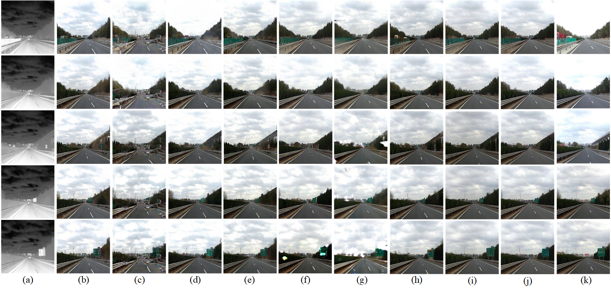

# MUGAN
Pytorch implementation of MUGAN.

## Prerequisites
- python 3.7
- torch 1.8.0
- torchvision 0.9.0
- dominate
- visdom 

## Data Preparation
Download the [KAIST-MS](https://github.com/SoonminHwang/rgbt-ped-detection/blob/master/data/README.md) and [IRVI](https://pan.baidu.com/s/1og7bcuVDModuBJhEQXWPxg?pwd=IRVI) dataset.

## Colorization results
### KAIST-MS dataset

### IRVI-Traffic dataset

### IRVI-Monitoring

## Acknowledgments
This code heavily borrowes from [TICCGAN](https://github.com/Kuangxd/TICCGAN).
